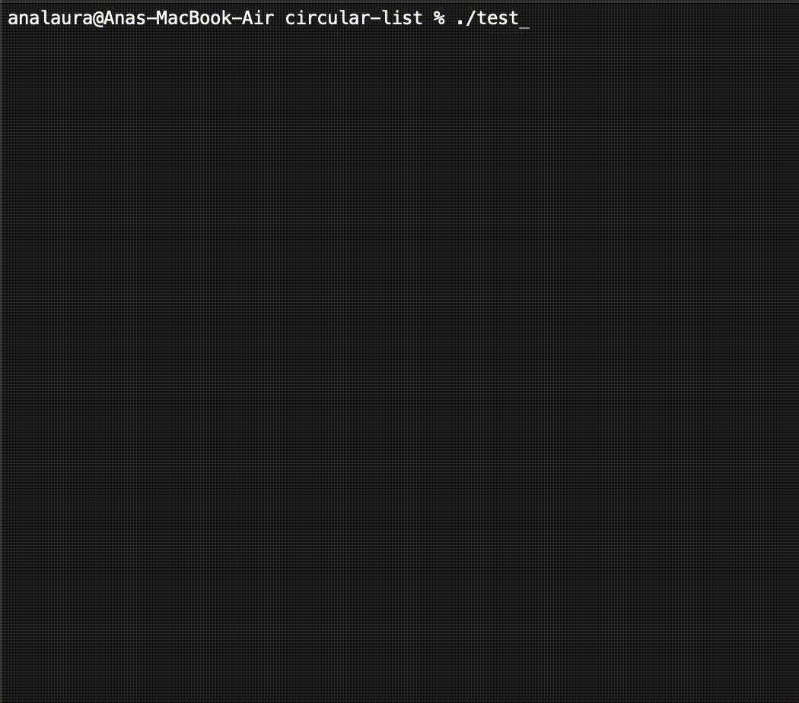
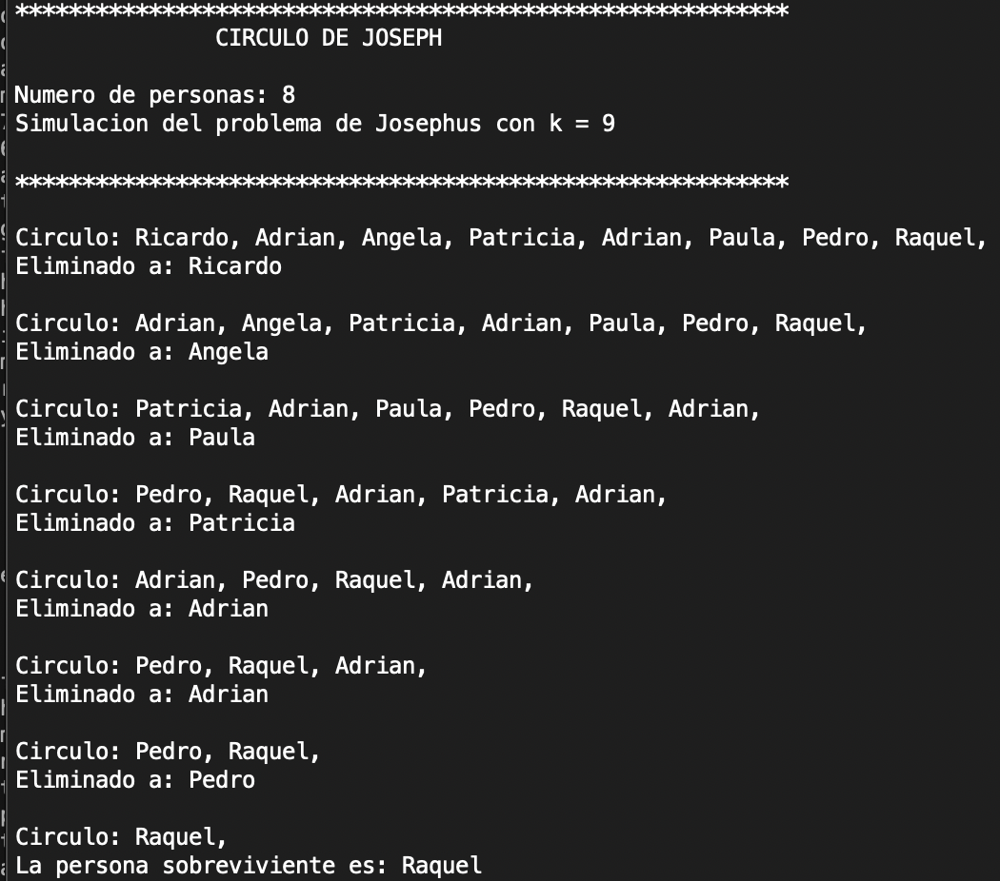

# Circular List (ListaCircular)

This project implements a **doubly-linked circular list** in C++. It was developed as an academic exercise to reinforce concepts of pointer manipulation, memory management, and circular data structures.

A circular list is a type of list where the last element points back to the first, forming a continuous loop. This version supports both forward and backward traversal.

---
This is an example of how to use the CircularList class, with the problem of the **Josephus** .


## Results


## Features

- Insert elements at the head
- Delete elements from the head
- Search for a value
- Move the current node forward or backward
- Get the current head value
- Print elements forward or backward
- Clear the list
- Compute the **Josephus problem** for any step `k`

---

## Example operations

```cpp
ListaCircular<int> lista;

lista.Agregar(10);
lista.Agregar(20);
lista.Agregar(30);

lista.ImprimirAdelante();   // Expected: 30 20 10
lista.ImprimirAtras();      // Expected: 10 20 30

lista.Avanzar();            // Moves current to next
lista.Retroceder();         // Moves current to previous

std::cout << lista.Cabeza() << std::endl;  // Shows current head value

if (lista.Buscar(20)) {
    std::cout << "Found!" << std::endl;
}

std::cout << "Size: " << lista.ObtenerTam() << std::endl;
```

---

## Josephus Problem

This list includes a `Josephus(int k)` method that solves the classical **Josephus problem**: given a circular arrangement, eliminate every `k`-th element until one remains. The function returns the survivor.

```cpp
ListaCircular<int> lista;
for (int i = 1; i <= 7; i++) {
    lista.Agregar(i);
}

std::cout << "Survivor: " << lista.Josephus(3) << std::endl;  // Example output: 4
```

---

## File Structure

- `ListaCircular.hpp`: Class declaration and template structure
- `ListaCircular.tpp`: Template implementation

---

## Exceptions

The class defines two custom exceptions:

- `ListaVacia`: Raised when operations are attempted on an empty list
- `FueraRango`: Raised when accessing invalid positions

---

## Author

- Ana Laura Chenoweth Galaz
- Georgina Salcido Valenzuela

---

## License

This code is for educational purposes. You are free to use or adapt it to learn more about circular lists, templates, and C++.

